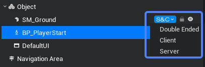
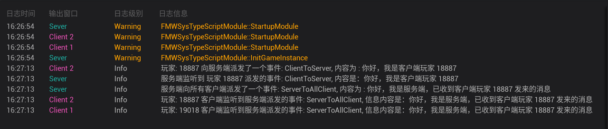

# Network Synchronization Structure and Mechanics

<strong>It takes approximately 15 minutes to read through this section.</strong>

To understand the principle of network synchronization, we must first answer a few essential questions:

1. Who is synchronizing with each other?
2. What are they synchronizing?
3. How to achieve network synchronization?

## What is a Client? What is a Server?

### 1.1 Client

The <strong>Client</strong>, or user-end, is the program that provides local services to clients as opposed to the server. Except for some applications that run only locally, they are generally installed on ordinary terminals and must run in conjunction with each other and the server.

The <strong>Game Client </strong>is the software that stores many resources in the game. Players input commands through the client, then the client translates them into data and sends them to the server. Afterward, the server gives the results after processing, and then the client translates them into graphical feedback for the players. One can say that the client is an intermediary between the player and the server.

In short, for game development, the client is the game program running on the player's terminal device.

For<strong> online games,</strong> the game data or game rules are stored or run <strong>on the server</strong>.

On the other hand, <strong>stand-alone games</strong> are not connected to the server and store game logic and data locally.

### 1.2 Server

A Server provides service for the client, such as providing resources to the client and saving client data. It is an important way to realize game characterization and the most direct method to express through the game. For example, if you want to modify the parameters of a certain NPC, simply reload it and it will be reflected immediately in the game.

Game Server provides services for the game client, such as providing login for the client, saving the game player information, and providing the player with online gameplay, all of which are key differences from stand-alone games. The game client's login requires the authorization of the server. For example, the game server provides the login to the player, and the login is the necessary tool to connect to the server, and the login can also be viewed as the authorization file of the server.

As mentioned above, the server carries great responsibility, it stores all the client's resources and data, even the game logic

Example Cases:

1. The synchronization mechanism of a casual <strong>tile-matching game</strong> is usually based on a weak network mechanism. It can be played as a single-player game when there is no internet connection. It stores the game results locally after the game is finished, then it uploads and synchronizes local data to the server when a network connection is available.
2. The synchronization mechanism of a real-time competitive game like <strong>Gobang</strong> requires real-time synchronization of data. The server creates a room, client 1 and client 2 join the room. All the data from the client's game is synchronized to the other clients in the room by the server. When the clients are running the game, the server has to make a logical judgment of victory and defeat according to the winning condition set by developers, then the obtained result will be synchronized to other clients in the room.

## Network Synchronization Structure

Before we can understand network synchronization in the editor, we need to first know the "Static" function.

### 2.1 Static


As shown above, if you check the box "Static", then that object is a static object, otherwise, it is a non-static object.

Static objects are frequently encountered in game development, quite literally, it means that the current object is static and immobile.

That is, all objects that are checked as static are not dynamically changeable.

This also means that static objects only need to be created on both the server and the client without needing any network synchronization, etc.

Example Cases:

The board of a chess game does not need to be moved, deformed, etc., and is generally a static object

The pieces, on the other hand, need to be created and destroyed dynamically, so they are generally non-static objects

## Differences between Client, Server, and Double-ended




As shown in the above two figures, there are two ways to set the "Network Status" of an object. The three different modes are Client, Server, and Double-ended (Server and Client).

### 2.2 Client

Objects with their "Network Status" set to "Client" will only be created on the client side. They will not be created on the server side and will not be synchronized.

Objects like special effects, item models, and UI resources are often set to "Client".

These objects are generally only needed for local rendering, playback, determination, etc.

Example:

Sound effects, special effects, etc., only create, play, and stop (and other operations) on the client.

### 2.3 Server

Objects with their "Network Status" set to "Server" will only be created on the server side. They will not be created on the client side and will not be synchronized.

Items that require server-side master control, like anti-cheat, server rules, etc., should be set to "Server. These are set by the server and not controllable by the client.

Example: coordinate anchor for NPC path navigation.

The client does not need to store and determine the anchor point object of the NPC. It only needs to request the server to send the coordinate information of the anchor point of the NPC, or directly return its path to seek the path when navigating.

### 2.4 Double-ended (Server and Client)

Objects with their "Network Status" set to "Double-ended" will first be loaded and created on the server side. The client loads the objects first, waits for a command from the server to create, and then establishes communication with the server.

Note that data synchronization is <strong>server-side oriented</strong>.

It is common to set objects that require synchronization (synchronization of multiple clients) to be double-ended.

Example:

Chess pieces, monsters, vehicles, etc.

Their coordinates, colors, collisions, and other interactions need to be determined and synchronized in real time.

## How to Achieve Network Synchronization

### 3.1 Client to Server

#### 3.1.1 Client dispatches

/**

* Client dispatches an event to the server
* @param eventName
* @param eventContent

*/

function DispatchToServer(eventName: string, ...params: unknown[]): DispatchEventResult;

``` ts
/** When the script is instantiated, this function will be called before the first frame is updated */
protected async onStart(): Promise<void> {
    
    // Client-side execution
    if(Gameplay.isClient()) {
        //Get the current client's player object for subsequent use
        let player = await Gameplay.asyncGetCurrentPlayer();

        // Declare a variable to be dispatched to the server: here it is a string
        let message = `Hi, I'm client player ${player.getPlayerID()}`;

        //Dispatch a message from the client to the server: event . Dispatch to the server ("event name", event content).
        Events.dispatchToServer("ClientToServer", message);

        //Print the send behavior to the console
        console.log(`Player: ${player.getPlayerID()} dispatched an event to the server: ClientToServer, containing the message: ${message}`);

    }

    //Server-side execution
    if(Gameplay.isServer()) {
        //The server listens for events dispatched from the client: Events.Add client listener ("event name", (client player sending the event, content sent by the client)).
        Events.addClientListener("ClientToServer", (player: Gameplay.Player, message: string) => {
            
            //Print the listening results to the console
            console.log(`The server hears the event that player ${player.getPlayerID()} dispatched. The event is: ClientToServer, the message content is：${message}`);
        }); 
    }

}
```

#### 3.1.2 Server listens

/**

* The server listens for events from the client
* @param eventName
* @param listener (Listening to the callback. The Player sends events to the client target event content)
* @return EventListener

*/

function AddClientListener(eventName: string, listener: (player: Gameplay.Player, ...params: unknown[]) => void): EventListener;

``` ts
/** When the script is instantiated, this function will be called before the first frame is updated */
protected async onStart(): Promise<void> {
    
    // Client-side execution
    if(Gameplay.isClient()) {
        //Get the current client's player object for subsequent use
        let player = await Gameplay.asyncGetCurrentPlayer();

        // Declare a variable to be passed to the server: here it is a string of type string
        let message = `Hi, I'm client player ${player.getPlayerID()}`;

        //Dispatch a message from the client to the server: event . Dispatch to the server ("event name", event content).
        Events.dispatchToServer("ClientToServer", message);

        //Print the send behavior to the console
        console.log(`Player: ${player.getPlayerID()} dispatched an event to the server: ClientToServer, containing the message: ${message}`);

    }

    //Server-side execution
    if(Gameplay.isServer()) {
        //The server listens for events dispatched from the client: Events. Add client listener ("event name", (client player sending the event, content sent by the client)).
        Events.addClientListener("ClientToServer", (player: Gameplay.Player, message: string) => {
            
            //Print the listening results to the console
            console.log(`The server hears the event that player: ${player.getPlayerID()} dispatched. The event is: ClientToServer, the message content is：${message}`);
        }); 
    }

}
```

### 3.2 Server to Client

#### 3.2.1 Server dispatches - single client

/** The server dispatches events to the designated client

* @param player
* @param eventName
* @param eventContent

*/

function DispatchToClient(player: Gameplay.Player, eventName: string, ...params: unknown[]): DispatchEventResult;

``` ts
/** When the script is instantiated, this function will be called before the first frame is updated */
protected async onStart(): Promise<void> {

    // Client-side execution
    if(Gameplay.isClient()) {
        //Get the current client's player object for subsequent use
        let player = await Gameplay.asyncGetCurrentPlayer();

        // Declare a variable to be dispatched to the server， here it's a string of type string
        let message = `Hi, I'm client player ${player.getPlayerID()}`;

        //Dispatch a message from the client to the server: event . Dispatch to the server ("event name", event content).
        Events.dispatchToServer("ClientToServer", message);

        //Print the send behavior to the console
        console.log(`Player: ${player.getPlayerID()} dispatched an event to the server: ClientToServer, containing the message: ${message}`);

         //Client listens to events dispatched from the server side: Events.Add server-side event listener ("event name", (what the server sends)).
         Events.addServerListener("ServerToClient", (reply: string) => {
            
            //Print the listening results to the console
            console.log(`Player: ${player.getPlayerID()} dispatched an event to the server: ClientToServer, containing the message: ${reply}`);

        }); 
    }

    //Server-side execution
    if(Gameplay.isServer()) {
        //The server listens for events dispatched from the client: Events.Add client-side event listener ("event name", (client player who sent the event, what the client sent)).
        Events.addClientListener("ClientToServer", (player: Gameplay.Player, message: string) => {
            
            //Print the listening results to the console
            console.log(`The server hears the event that player:${player.getPlayerID()} dispatched: ClientToServer, the message content is：${message}`);

             //Declare a variable to be passed to the client: here it is a string of type string
            let reply = `Hi, this is the server. The message sent by player ${player.getPlayerID()} has been received`;
            
            //Dispatch a message from the server to the specified client: event. Dispatch to the server (specified client, "event name", event content).
            Events.dispatchToClient(player, "ServerToClient", reply);

             //Print the send behavior to the console
            console.log(`Server dispatches to player${player.getPlayerID()} an event: ServerToClient, message content is: ${reply}`);

        }); 
    }

}
```

#### 3.2.2 Server dispatches - all clients

/** Server dispatches events to all clients

* @param player
* @param eventName
* @param params

*/

function DispatchToAllClient(player: Gameplay.Player, eventName: string, ...params: unknown[]): DispatchEventResult;

``` ts
/** When the script is instantiated, this function will be called before the first frame is updated */
protected async onStart(): Promise<void> {

    // Client-side execution
    if(Gameplay.isClient()) {
        //Get the current client's player object for subsequent use
        let player = await Gameplay.asyncGetCurrentPlayer();

        //Declare a variable to be dispatched to the server: here it is a string of type string
        let message = `Hi I am client player ${player.getPlayerID()}`;

        // Press the G key on the keyboard
        Events.onKeyDown(Type.Keys.G, () => {
            //Dispatch a message from the client to the server: Event. Dispatch to the server ("event name", event content).
            Events.dispatchToServer("ClientToServer", message);

            //Print the send behavior to the console
            console.log(`Player: ${player.getPlayerID()} dispatches an event to the server: ClientToServer, message content is: ${message}`);
        });
       

         //Client listens to events dispatched from the server side: Events. Add server-side event listener ("event name", (what the server sends)).
         Events.addServerListener("ServerToAllClient", (reply: string) => {
            
            //Print the listening results to the console
            console.log(`Player: ${player.getPlayerID()} The client hears to the events dispatched by the server: ServerToAllClient, message content: ${reply}`);

        }); 
    }

    //Server-side execution
    if(Gameplay.isServer()) {
        //The server listens for events dispatched from the client: Events. Add client-side event listener ("event name", (client player who sent the event, what the client sent)).
        Events.addClientListener("ClientToServer", (player: Gameplay.Player, message: string) => {
            
            //Print the listening results to the console
            console.log(`The server hears the event that player ${player.getPlayerID()} dispatched: ClientToServer, the message content is：${message}`);

             // Declare a variable to be passed to the client: here it is a string
            let reply = `Hi, this is the server. The message sent by player ${player.getPlayerID()} has been received`;
            
            //Dispatch messages from the server side to all clients: Event.Dispatch to the server side ("event name", event content).
            Events.dispatchToAllClient("ServerToAllClient", reply);

             //Print the send behavior to the console
            console.log(`The server dispatches an event to all clients: ServerToAllClient, the content is: ${reply}`);

        }); 
    }

}
```


#### 3.2.3 Server listens

/**

* Client listens to server events
* @param eventName
* @param listener, eventContent
* @return EventListener

*/

function AddServerListener(eventName: string, listener: ((...params: unknown[]) => void)): EventListener;

``` ts
/** When the script is instantiated, this function will be called before the first frame is updated */
protected async onStart(): Promise<void> {

    // Client-side execution
    if(Gameplay.isClient()) {
        //Get the current client's player object for subsequent use
        let player = await Gameplay.asyncGetCurrentPlayer();

        //Declare a variable to be passed to the server: here it is a string
        let message = `Hi, I'am client player ${player.getPlayerID()}`;

        // Press the G key on the keyboard
        Events.onKeyDown(Type.Keys.G, () => {
            //Dispatch a message from the client to the server: event . Dispatch to the server ("event name", event content).
            Events.dispatchToServer("ClientToServer", message);

            //Print the send behavior to the console
            console.log(`Player: ${player.getPlayerID()} dispatched an event the server: ClientToServer, the content is : ${message}`);
        });
       

         //Client listens to events dispatched from the server side: Events . Add server-side event listener ("event name", (what the server sends)).
         Events.addServerListener("ServerToAllClient", (reply: string) => {
            
            //Print the listening results to the console
            console.log(`Player: ${player.getPlayerID()} The client listens to the event sent by the server: ServerToAllClient, the message is：${reply}`);

        }); 
    }

    //Server-side execution
    if(Gameplay.isServer()) {
        //The server listens for events dispatched from the client: Events. Add client-side event listener ("event name", (client player who sent the event, what the client sent)).
        Events.addClientListener("ClientToServer", (player: Gameplay.Player, message: string) => {
            
            //Print the listening results to the console
            console.log(`The server hears the event that player ${player.getPlayerID()} sent: ClientToServer, the content is：${message}`);

             // Declare a variable to be passed to the client: here it is a string of type string
            let reply = `Hi, this is the server. The message sent by player ${player.getPlayerID()} has been received`;
            
            //Dispatch messages from the server side to all clients: Event.Dispatch to the server side ("event name", event content).
            Events.dispatchToAllClient("ServerToAllClient", reply);

             //Print the send behavior to the console
            console.log(`The server dispatches an event to all clients: ServerToAllClient, the content is: ${reply}`);

        }); 
    }

}
```



## Use “replicated” to Synchronize Properties

Example

``` ts
@Core.Class
export default class NewScript0 extends Core.Script {

    @Core.Property({replicated: true, onChanged: "onChanged"})
    testNumber: number = 10; 

    onChanged(): void{
        console.log(`testNumber value has changed, the current value is ${this.testNumber}`);
    }

    /** When the script is instantiated, this function will be called before the first frame is updated */
    protected async onStart(): Promise<void> {

        // Client-side execution
        if(Gameplay.isClient()) {
            //Get the current client's player object for subsequent use
            let player = await Gameplay.asyncGetCurrentPlayer();

            // Press the G key on the keyboard
            Events.onKeyDown(Type.Keys.G, () => {
                //Dispatch a message from the client to the server: event . Dispatch to the server ("event name", event content).
                Events.dispatchToServer("addTestNumber");

                //Print the send behavior to the console
                console.log(`Player: ${player.getPlayerID()} dispatched an event the server: addTestNumber`);
            });
        
        }

        //Server-side execution
        if(Gameplay.isServer()) {

            console.log(`testNumber initial value is ${this.testNumber}`);

            //The server listens for events dispatched from the client: Events. Add client-side event listener ("event name", (the client player sending the event)).
            Events.addClientListener("addTestNumber", (player: Gameplay.Player) => {
                
                //Print the listening results to the console
                console.log(`The server hears the event that player ${player.getPlayerID()} dispatched: addTestNumber, the server will add 1 to testNumber`);

                this.testNumber += 1;

            }); 
        }

    }

    /**
     * Periodic function, executes every frame
     * The execution of this function requires that this.bUseUpdate be set to true
     * @param dt Delay between the current frame and the previous frame / sec
     */
    protected onUpdate(dt: number): void {

    }

    /** This function is called after the last frame is executed when the script is destroyed */
    protected onDestroy(): void {

    }
}
```


#### Important Notes：

- Using the class must be annotated with Class or GameObject
- Must derive from Script or GameObject type
- Use the Property annotation to annotate properties that need to be synchronized
- Register property synchronization callback functions
- Synchronized properties are only triggered by changes on the Server side
