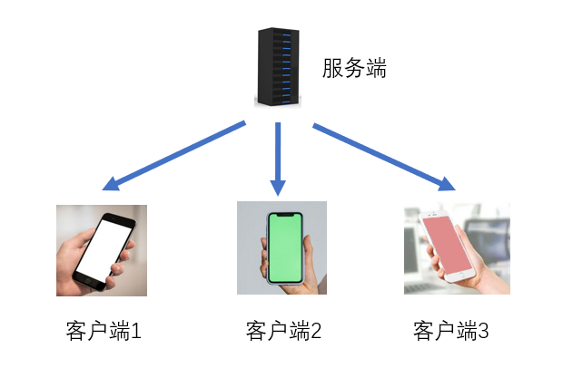

## 2.2 Client & Server

It takes approximately 9 minutes to read this article.

One of the core functions of Playza Studio is to allow developers to quickly and conveniently create a multiplayer game. But since it is a multiplayer game, we first need to understand what is a client and what is a server.

## Traditional Game Server

The server generally refers to a set of programs that run on a dedicated server. The program is mainly used to control the game logic of the client, receive and process client requests, provide game resources for clients, and save client data.

In traditional game development, in addition to writing client game code, we need to write a large amount of code for an independent server application, and purchase a server to deploy the server application to complete the server part.

## Traditional Game Client

The client is also the player's side and is a program that directly operates the game. It is mainly used to receive various user inputs and display various game effects after being connected to the server. The server and client are a one-to-many form, and each client runs on a user's game device, such as a mobile phone, computer, or console.

## Playza Studio's Client and Server

In the previous section, we can see that in traditional game development, in addition to developing the client part, a large amount of manpower and financial resources are needed to develop the server part. This can be a significant burden for independent games or studios.

Playza Studio provides a server for developers to use for free, eliminating the need for users to write separate server code and perform complex deployment operations. In Playza Studio, developers are provided with very easy-to-use network synchronization capabilities, and they do not need to distinguish between client and server for script writing. Developers only need to understand which code in their game logic should be written on the client and which should be written on the server to develop a very beautiful multiplayer online game.

### 3.1 Network Status

In Playza Studio, each game object we create has three network statuses (operating environments): Client-only, Server-only, and Client & Server. The differences between them are listed in the table below. You can first take a look at the table for a general understanding. After you have mastered the basic development process of the editor, we recommend that you come back to study the table in detail. The table is shown below:

| Environment       |  |  |                                                                                       |
| ----------------- | ------------------------------------------- | ------------------------------------------- | -------------------------------------------------------------------------------------------------------------------------------- |
| Display on Client | ✔                                          | ❌                                          | ✔                                                                                                                               |
| Display on Server | ❌                                          | ✔                                          | ✔                                                                                                                               |
| Collision         | ❌                                          | ❌                                          | ✔                                                                                                                               |
| Control on Client | ✔                                          | ❌                                          | ✔                                                                                                                               |
| Control on Server | ❌                                          | ✔                                          | ✔                                                                                                                               |
| Generation Method | Client Generation                           | Server Generation                           | The server generates the object and synchronizes it with the client, which then generates the object based on the received data. |

Here are some typical examples to help everyone understand how to choose the right network status for objects:

1. In most games, when we see objects jitter, it's because of inconsistencies between the front-end and back-end. The server constantly pulls the client's position, so if there are any collisions involved, it should certainly be double-ended (Client & Server).
2. Special effects and sound effects are client-only effects and will not have any impact on the game's logic and functionality. So the network status of these objects should be Client-only.

### 3.2 Static & Dynamic Objects

In game development, many game objects do not change at all from the beginning to the end of the game, such as a fixed stone, an unbreakable tree, or clouds in the sky. These types of game objects do not participate in calculations and can still run normally. In order to have better performance, we distinguish between the two types of objects. The aforementioned unchanging objects can be set as static objects, while those that need to change in the game, such as moving, rotating, scaling, color-changing, generating, and removing, need to be set as dynamic (non-static) objects. The specific settings can be seen in section 3.6 "Using Game Objects".

Dynamic and static objects will have different effects under different operating environments. Here we still list a table for everyone to have a basic understanding. After mastering the basic development process of the editor, it is recommended to come back and study the table in detail. The table is as follows:

Dynamic Objects:

|                  | Dynamic Client-side                | Dynamic Server-side                | Dynamic Client and Server |
| ---------------- | ---------------------------------- | ---------------------------------- | ------------------------- |
| Modifiable       | ✔                                 | ✔                                 | ✔                        |
| Collision        | ✔(may result in position pulling) | ✔(may result in position pulling) | ✔                        |
| Object exists on | Client                             | Server                             | Both                      |

Static Objects:

|                  | Static Client-side | Static Server-side | Static Client and Server |
| ---------------- | ------------------ | ------------------ | ------------------------ |
| Modifiable       | ❌                 | ❌                 | ❌                       |
| Collision        | ❌                 | ❌                 | ✔                       |
| Object exists on | Client             | Server             | Both                     |

Note: A server-only static object is meaningless. Server-only static means that the object only exists on the server, and it is also static. Therefore, no clients will ever know the existence of this object, making it meaningless.

## Further Information

Please refer to the product documentation for more information on this topic: [Network Synchronization Structure and Mechanics](https://meta.feishu.cn/wiki/wikcnlv3rk0JTPn5rONhgYP5kwe)
